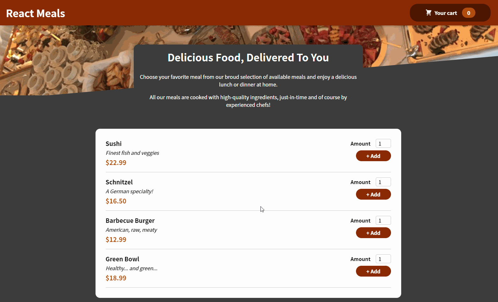

# React Meals :meat_on_bone:
### React / Redux Udemy Course

### Description:

Goal of project was to take a deeper dive into the **React Context API** and **UseReducer**. Data fetched from and posted to Firebase Realtime Database. Also features form validation and error handling.

### Demo: 
#### Submit Order/Form Input Validation:

## Contact:
#### Portfolio: [Logan Development](https://logandevelopment.io)
#### Linked In: [Connect on LinkedIn](www.linkedin.com/in/mlogan5212)
#### Front-End Capstone: [Not The Office Again](https://ntoa.logandevelopment.io)
